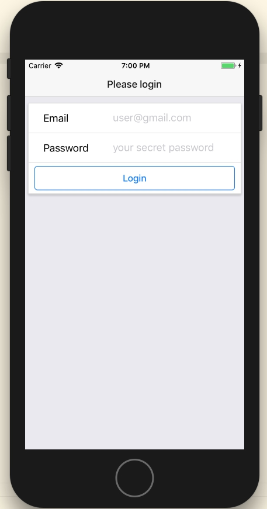
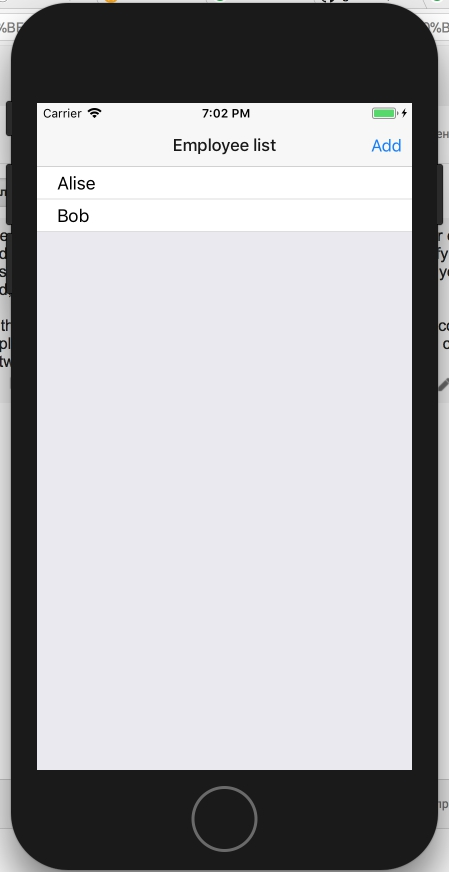
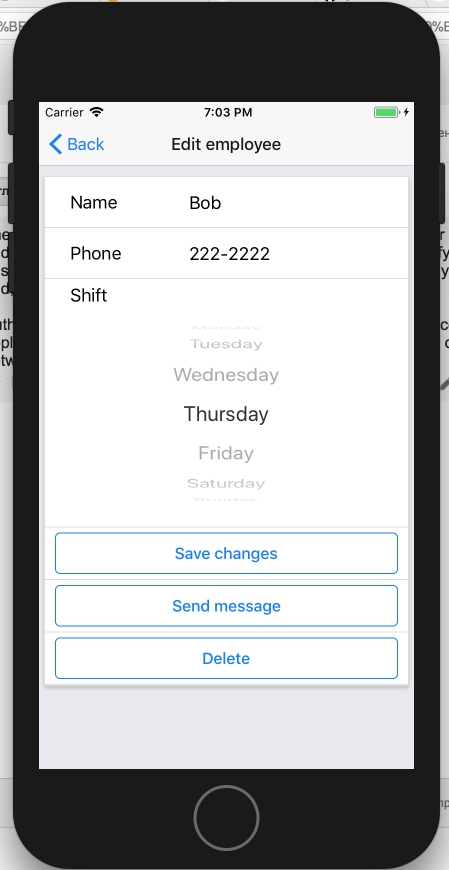
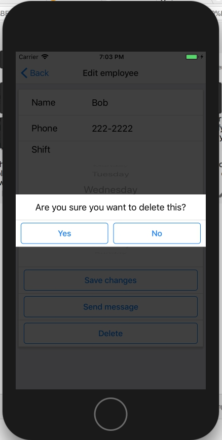

# Manager

Exercise project from excellent "[The Complete React Native and Redux Course](https://www.udemy.com/the-complete-react-native-and-redux-course/learn/v4/overview)" course by Stephen Grider.

The application allows you to keep a list of employees, store their contact information and send messages to them. You can register in the application by specifying email and password. After that, a list of your employees will be available to you. You can add, delete, edit employees and send them text messages.

Authorization and data storage are performed using Firebase. To control the state of the application Redux, React-Redux and Redux Thunk are used. To control transitions between screens react-native-router-flux is used.






## Installation

1. Install XCode (with iOS emulator).
2. Install React Native.
3. Run this project with

```
react-native run_ios
```
